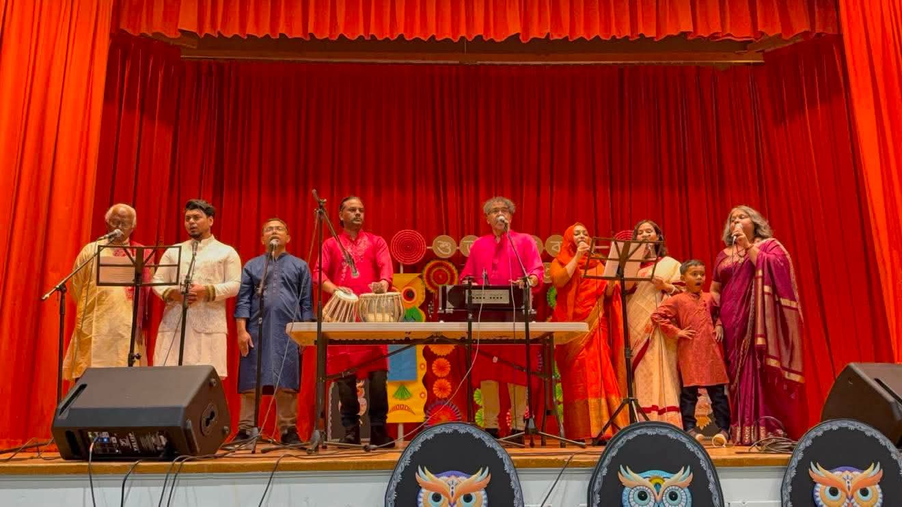
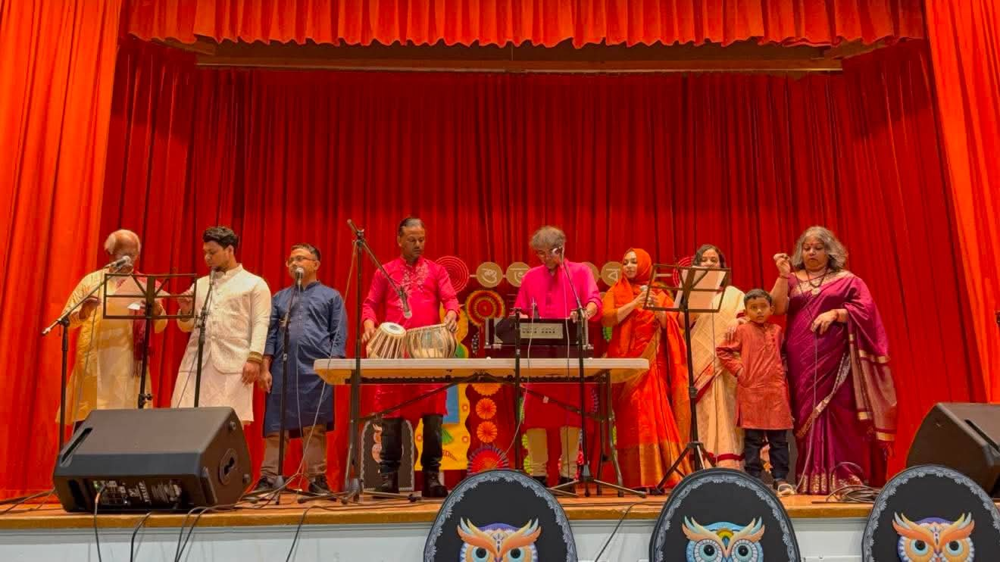
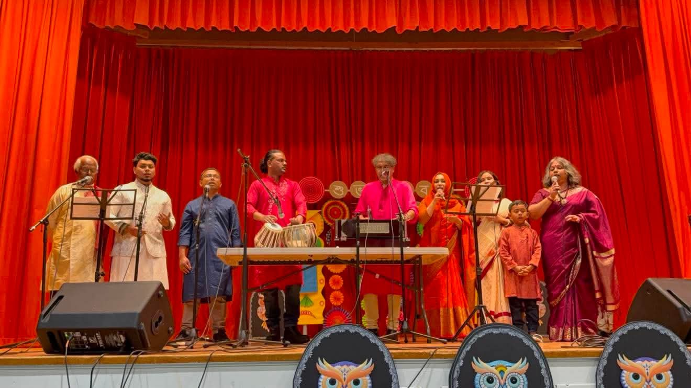
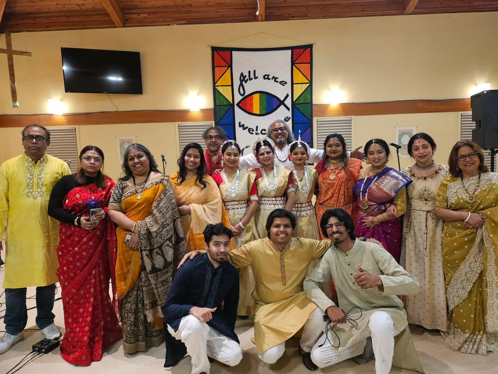

Click any photo to open the full screen slideshow for that occasion.

### Bengali New Year (Borshoboron/Pohela Boishakh) - Regina Bengali Hindu Community

::: {layout-ncol=3}

{.lightbox}

{.lightbox}

{.lightbox}

{.lightbox}

{.lightbox}

:::

---

### Pohela Falgun (Bengali Spring Festival) 2026

::: {layout-ncol=3}

{.lightbox}

{.lightbox}

{.lightbox}

:::

---

